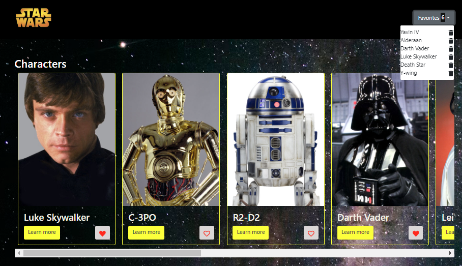

# Star Wars React App

Una aplicación web desarrollada con React que permite a los usuarios explorar personajes, planetas y vehículos del universo de Star Wars. Los usuarios pueden ver detalles específicos de cada elemento y añadir sus favoritos a una lista personal.

 

## Características

- Explora una lista de personajes, planetas y vehículos de Star Wars.
- Visualiza los detalles de cada elemento en páginas dedicadas.
- Añade elementos a tu lista de favoritos y gestiona esa lista.
- Navegación fácil a través de la aplicación con un menú fijo.

## Tecnologías Utilizadas

- **React**: Para la construcción de la interfaz de usuario.
- **React Router**: Para la navegación entre diferentes vistas.
- **React Icons**: Para los iconos de favoritos.
- **Bootstrap**: Para estilos y diseño responsivo.
- **Context API**: Para el manejo del estado global de la aplicación.

## Instalación

Sigue estos pasos para instalar y ejecutar la aplicación en tu entorno local:

1. Instala las dependencias necesarias:
    ```bash
    npm install
    ```

2. Inicia la aplicación:
    ```bash
    npm run start
    ```

## Estructura del Proyecto

### Componentes

- **Card**: Muestra una tarjeta con la información básica de un elemento (personaje, planeta o vehículo). Permite al usuario ver más detalles o agregar el elemento a su lista de favoritos.
  - **Props**: `name`, `uid`, `type`, `typeImg`
  - **Funciones principales**:
    - Mostrar imagen y nombre del elemento.
    - Añadir o eliminar elementos de la lista de favoritos.

- **DetailsPeople**: Muestra detalles de un personaje específico, incluyendo su nombre, año de nacimiento, género, altura, color de piel y color de ojos.
  - **Utiliza**: `useContext`, `useParams`
  - **Ruta**: `/details/people/:uid`

- **DetailsPlanets**: Muestra detalles de un planeta específico, como su nombre, diámetro, período orbital, población, clima y terreno.
  - **Utiliza**: `useContext`, `useParams`
  - **Ruta**: `/details/planets/:uid`

- **DetailsVehicles**: Muestra detalles de un vehículo específico, incluyendo nombre, modelo, clase de nave, costo, número de pasajeros y fabricante.
  - **Utiliza**: `useContext`, `useParams`
  - **Ruta**: `/details/vehicles/:uid`

- **Navbar**: Proporciona la barra de navegación principal, que incluye un enlace al inicio y un menú desplegable para los favoritos del usuario.
  - **Funciones principales**:
    - Navegar a la página de inicio.
    - Mostrar una lista desplegable de elementos favoritos con la opción de eliminar.

### Vistas

- **Home**: Muestra listas de personajes, planetas y vehículos. Utiliza el componente `Card` para mostrar cada elemento.
  - **Utiliza**: `useContext`
  - **Ruta**: `/`

- **Details**: Muestra detalles de un elemento específico basado en el tipo (personaje, planeta o vehículo) y el ID. Utiliza los componentes `DetailsPeople`, `DetailsPlanets`, o `DetailsVehicles` según el tipo.
  - **Utiliza**: `useContext`, `useParams`, `useEffect`
  - **Ruta**: `/details/:type/:uid`

### Estado Global y Contexto

- **Flux (State Management)**: Define las acciones y el estado global de la aplicación. Utiliza funciones para obtener datos de la API de Star Wars, añadir y eliminar favoritos, y manejar detalles de los elementos.
  - **Funciones principales**:
    - `getPeople()`: Obtiene una lista de personas.
    - `getPlanets()`: Obtiene una lista de planetas.
    - `getStarships()`: Obtiene una lista de naves.
    - `getDetails(uid, type)`: Obtiene detalles de un elemento específico.
    - `addFavorites(name)`: Añade un elemento a la lista de favoritos.
    - `deleteFavorite(index)`: Elimina un elemento de la lista de favoritos.

- **AppContext**: Proporciona el contexto global para la aplicación utilizando la API de Context de React. Inicializa el estado y las acciones, y proporciona estos datos a los componentes de la aplicación.
  - **Utiliza**: `useState`, `useEffect`, `React.createContext`

### Rutas

- **Layout**: Configura las rutas principales de la aplicación utilizando `react-router-dom`. Incluye rutas para la página principal, detalles de elementos, y una ruta de error para páginas no encontradas.
  - **Ruta principal**: `/` (Home)
  - **Ruta de detalles**: `/details/:type/:uid`
  - **Ruta de error**: `*` (No encontrado)

## Uso

1. Navega por la lista de personajes, planetas o vehículos en la página principal.
2. Haz clic en "Learn more" en cualquier tarjeta para ver los detalles.
3. Añade elementos a tu lista de favoritos usando el icono de corazón en cada tarjeta.
4. Gestiona tus favoritos a través del menú desplegable en la barra de navegación.


## Mejoras Futuras

- Implementación de búsquedas y filtros para encontrar elementos más fácilmente.
- Añadir más categorías y datos del universo de Star Wars.
- Mejora de la experiencia de usuario con animaciones y transiciones.

---

## Peticiones a la API

La aplicación utiliza la API de Star Wars para obtener datos sobre personajes, planetas y vehículos. Las peticiones se realizan a través de funciones definidas en el archivo `flux.js`. Aquí se detallan algunas de las funciones clave:

- **`getPeople()`**: Realiza una petición GET a `/people` para obtener una lista de personajes.
- **`getPlanets()`**: Realiza una petición GET a `/planets` para obtener una lista de planetas.
- **`getStarships()`**: Realiza una petición GET a `/starships` para obtener una lista de naves.
- **`getDetails(uid, type)`**: Realiza una petición GET a `/${type}/${uid}` para obtener detalles de un elemento específico.

Estas funciones manejan las respuestas y errores de las peticiones, actualizando el estado global de la aplicación según los datos recibidos.
